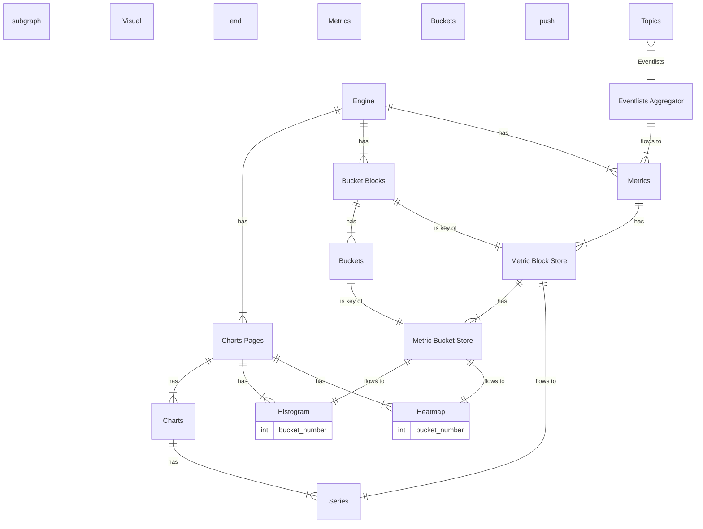
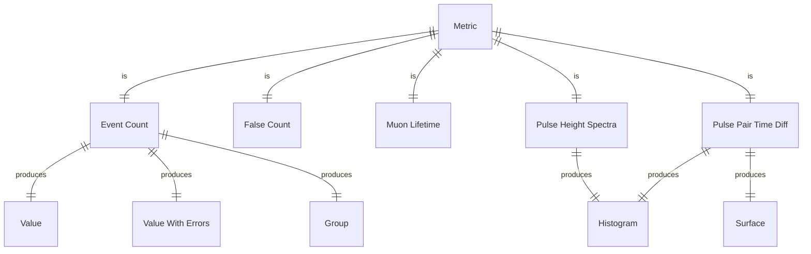

# Events Analyser

```mermaid
erDiagram

engine[Engine]

subgraph "Visual"
    charts_pages["Charts Pages"]
    charts["Charts"]
    series["Series"]
    histogram["Histogram"] {
        int bucket_number
    }
    heatmap["Heatmap"] {
        int bucket_number
    }

    charts_pages ||--|{ charts : has
    charts_pages ||--|{ histogram : has
    charts_pages ||--|{ heatmap : has
    charts ||--|{ series : has
end

subgraph "Metrics"
    metrics["Metrics"]
    metrics_block_store["Metric Block Store"]
    metrics_bucket_store["Metric Bucket Store"]
    subgraph "Buckets"
        bucket_blocks["Bucket Blocks"]
        buckets["Buckets"]
        bucket_blocks ||--|{ buckets : has
    end
    metrics ||--|{ metrics_block_store : has
    metrics_block_store ||--|{ metrics_bucket_store : has
end

engine ||--|{ charts_pages : has
engine ||--|{ bucket_blocks : has
engine ||--|{ metrics : has

bucket_blocks ||--|| metrics_block_store : "is key of"
buckets ||--|| metrics_bucket_store : "is key of"
metrics_bucket_store ||--|| histogram : "flows to"
metrics_bucket_store ||--|| heatmap : "flows to"
metrics_block_store ||--|| series : "flows to"


subgraph push
    topics["Topics"]
    eventlists_aggregator["Eventlists Aggregator"]
    topics }|--|| eventlists_aggregator : "Eventlists"
    eventlists_aggregator ||--|{ metrics: "flows to"
end
```

```mermaid
erDiagram

metric["Metric"]
metric_event_count["Event Count"]
metric_false_count["False Count"]
metric_lifetime["Muon Lifetime"]
metric_pulse_height["Pulse Height Spectra"]
metric_pulse_pair_diff["Pulse Pair Time Diff"]

metric ||--|| metric_event_count : is
metric ||--|| metric_false_count : is
metric ||--|| metric_lifetime : is
metric ||--|| metric_pulse_height : is
metric ||--|| metric_pulse_pair_diff : is

output_value["Value"]
output_value_errors["Value With Errors"]
output_group["Group"]
output_histogram["Histogram"]
output_surface["Surface"]

metric_event_count ||--|| output_value : "produces"
metric_event_count ||--|| output_value_errors : "produces"
metric_event_count ||--|| output_group : "produces"

metric_pulse_height ||--|| output_histogram : "produces"

metric_pulse_pair_diff ||--|| output_histogram : "produces"
metric_pulse_pair_diff ||--|| output_surface : "produces"
```
